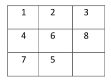
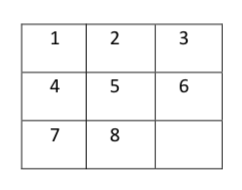
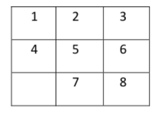

# 8-Puzzle-Solver

## Summary
Implemented Djikstra's algorithm to find the shortest path to solve cost version of 8-puzzle game.

## Goal
The goal of this assignment is to get some practice with shortest path algorithms.

## Problem Statement
Most of you may have played an 8-puzzle game in childhood. The game consists of a 3x3 grid with 8 tiles numbered 1 to 8. There is one gap in the puzzle that allows movement of tiles. Tiles can move horizontally or vertically. Here may be one starting configuration of an 8-puzzle: 

We will use the word “state” to refer to each configuration of the puzzle. We can call the configuration above as the “start state”. Typically, our goal is to reach this configuration (goal state) 

One possible solution to reach the target in this example is by moving 8 down, 6 right, 5 up and then 8 left. The task in this assignment is to find this shortest path using Djikstra’s algorithm. 

To make a twist in the assignment, we will play a cost-version of the game. Here you will be given a cost function described by 8 integers, d1 ... d8, such that moving the tile numbered i will cost di units. If d1 = 1 and d2 = 7, then you can move 1 seven times to cost equal to moving 2 once. You will be given several test cases, and each test case will consist of a start state, a goal state, and a cost function. Your task is to find the cheapest path to the goal. If multiple paths exist with the same minimum cost, print the path with fewest moves. If multiple optimal paths to the goal exist which take the fewest moves, then you can print any of them. 

We can easily represent an 8-Puzzle configuration using a 9-character string if we call the GAP G. For example, the first configuration above will look like 12346875G.
## Input File
The input filename will be given as a system argument when the code is run. The first line will consist of an integer T denoting the number of testcases in the file. T will be <= 200. 

The first line of each test case consists of two space separated strings representing the start state and the goal state. The second line of a test case consists of 8 non-negative integers, d1 ... d8 representing the cost function (0 <= di <= 1000). It is guaranteed that both the start state and the goal state are permutations of “12345678G”. 
  
A sample input file is as follows: 
4 
12346875G 12345678G 
1 2 3 4 5 6 7 8 
12346875G 123456G78 
0 0 0 0 0 0 0 0 
12346875G 1b2346875G 
1 2 3 4 4 3 2 1 
12346875G 12346857G 
12345678 

## Output File
Your code should generate an output file, whose name will be given as a system argument during runtime. For each test case, write two lines. In the first line you should write a line with two integers `n` and `d`, the number of moves in the optimal path to reach the goal state from the start state, and the cost of the optimal path. If goal state is not reachable then print “-1 -1” (without quotes). 

In the next line, if a path exists, then write n space separated tokens to describe the moves in your optimal path. Each token consists of an integer from 1 to 8 and a character in {U, D, L, R} which describes which number was moved in the position of the gap, and the direction it moved. For example, suppose your code computes solution “8 down, 6 right, 5 up, 8 left” (4 moves, cost 27) for first test case and “8 down, 6 right, 5 up, 7 right” (4 moves, cost 0) for the second test case (and so on), you will output the following output file. If the path is of length 0, or it doesn’t exist, leave this line blank. 
4 27 
8D 6R 5U 8L 
4 0 
8D 6R 5U 7R 
0 0 
<blank line> 
-1 -1 
<blank line> 
  
## Method
First, compute the graph of the 8-Puzzle game. The set of vertices will be all states and edges will denote all possible valid moves. Then use Djikstra’s to find the cheapest path. Also supply a compile and a run script.

## What is being provided?
We will be providing you the following tools to help check your code.
1. formatChecker.py: This takes an input file and an output file and verifies that all the paths from the start state to goal state in the output file are correct, and the cost is calculated correctly. It does NOT check if the paths are optimal and if the path exists. (Usage: python formatChecker.py input.txt output.txt)
2. randomMoves.py: This takes an integer n as argument. It randomly selects a board, and performs n random moves on it. It will print the start state, the end state and the moves that it followed. You may use this to generate testcases for your self.
3. uniform_cost_optimal.txt: This is the optimal cost to all the states from [[1, 2, 3], [4, 5, 6], [7, 8, _]] assuming that each step had cost 1, i.e. the cost function is uniform. More testcases will be posted on piazza soon.
Note that the python code is written so that it is compliant with both python2 and python3. It has been tested on Linux and Mac OS X, but not on Windows.
