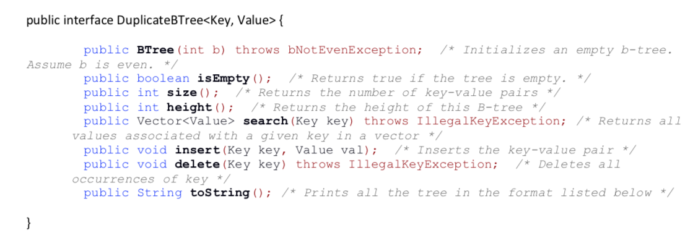
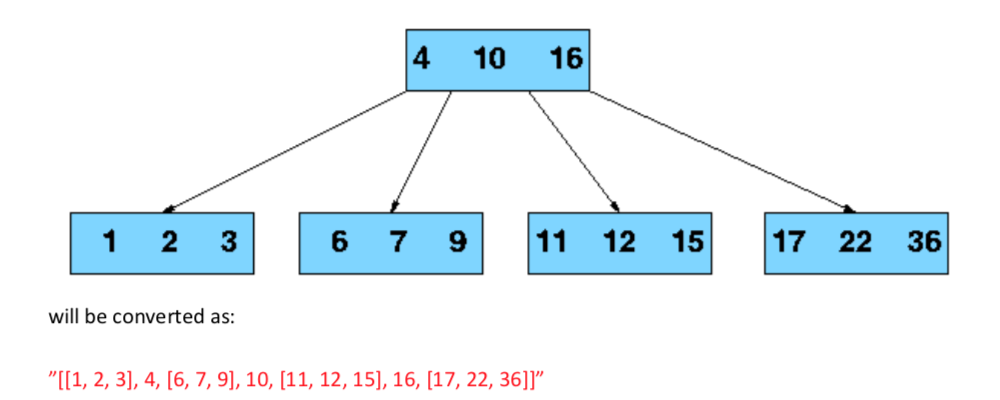

# B-Tree-COL106

## Goal
The goal of this assignment is to get some practice with binary search trees, specifically B-Trees. B-Trees are one of the most important data structures we will study in this class – they are regularly used in large database systems for storing indexes on the records. However, just for fun, we will make one significant departure from standard B-trees. We will allow duplicate keys, i.e., a tree can have an unbounded number of keys that have the same value.

## Problem Statement
Your task is to implement a generic DuplicateBTree class. As is to be expected, DuplicateBTree must implement the BTree ADT we studied in class, except that it can contain multiple copies of the same key (at times with exactly the same value). This implies you will have to change the algorithms for searching, inserting and deleting suitably. The exact interface will be as follows:

Your implementation will have to define a node class which will maintain all keys in the node (you may use an array for this), and references to all children. The format for toString function defined above is as follows: 

To convert a tree to string, just convert its root to string. Converting a node to string is defined recursively. Nodes that are null, are mapped to empty strings. The mapping of a node, is just the concatenation of the mappings of its children, separated by the key value pairs present at the node, and surrounded by rectangular brackets []. For example, neglecting the values,

Now, we have key value pairs instead of simple set of keys, we just replace a single key output in the above string by the key value pair. For example, if in the above tree, the values were the string representations of the numbers, then the answer would be:
”[[1=One, 2=Two, 3=Three], 4=Four, [........”]

## What is being provided
We have provided code that can be used to interact with your btree implementation using a simple commands. We expect you to not alter that code, as it will be used to check the correctness of your code. You can only modify the BTree.java file, along with adding new java classes. 
The provided folder is a valid eclipse and intellij idea project, and can be directly imported or opened using the IDE of your choice. You can also work using simple text editors like vim if you want.
